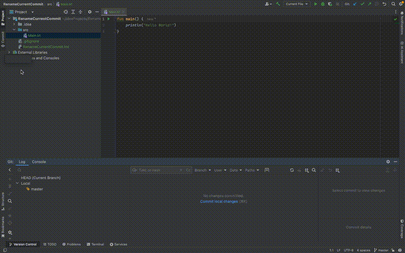

# Rename Current Commit - JetBrains Plugin

🚀 **Rename Current Commit** is a JetBrains IDE plugin that allows users to rename the latest **unpushed Git commit** directly from the Git toolbar. This enhances workflow efficiency by providing a quick way to modify recent commit messages without using the command line.

---

## **📌 Features**

✅ **Rename Latest Commit** – Modify the message of the most recent **unpushed** commit.  
✅ **Git Integration** – Uses Git's **amend commit** functionality seamlessly.  
✅ **Pre-checks for Unpushed Commits** – Ensures that only unpushed commits can be renamed.  
✅ **Integrated UI** – Accessible from the **Git toolbar** and **VCS Operations Popup**.

---

## **📂 Project Structure**
```
📦 rename-current-commit
├── 📂 src                                               # JetBrains plugin core 
│   ├── /main/kotlin/com/rbbozkurt/renamecommit 
│   │   ├── RenameCommitAction.kt                        # Main action logic 
├── README.md                                            # Documentation
```

---

## 🛠️ Setup & Installation

### 🔴 Prerequisites

Before running the plugin, ensure you have the following installed:
- **JetBrains IDE** (IntelliJ IDEA, PyCharm, WebStorm, etc.)
- **Java 17+**
- **Gradle** *(if not installed globally, the project will use `./gradlew`)*

---

### **🚀 Running the Plugin in IntelliJ IDEA**

1️⃣ **Clone the repository**:
```bash
git clone https://github.com/rbbozkurt/rename-current-commit.git
cd rename-current-commit
```
2️⃣ Open the project in IntelliJ IDEA.

3️⃣ Run the plugin:
```bash
./gradlew runIde
```

This will start a JetBrains IDE instance with the plugin loaded.
## 🎬 Demo
### Renaming the current Commit



## 🖥️ Development

To make changes to the plugin:
Modify files under `src/main/java/com/rbbozkurt/renamecommit/`.
Run the plugin using:
```bash
./gradlew runIde
```
Test it inside the JetBrains IDE.

## 📌 How It Works

1️⃣ Navigate to Git Toolbar

`Click Git → Rename Current Commit`

2️⃣ Enter New Commit Message

A prompt appears asking for a new commit message. 
If no unpushed commits exist, an error is displayed.

3️⃣ Commit is Renamed

The commit message is amended using Git's `--amend -m` option.

## **📧 Contact**

👤 **R. Berkay Bozkurt**  
📧 Email: resitberkaybozkurt@gmail.com  
📂 GitHub: [github.com/rbbozkurt](https://github.com/rbbozkurt)